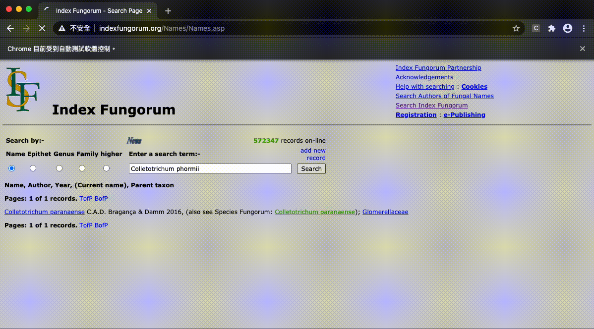

<h1 align="center">Welcome to Index Fungorum web-crawling </h1>
<p align="center">
  <a>
    
  </a>
  <a>
    
  </a>
</p>

# Index Fungorum web-crawling


##  Demo

<p align="center"> 

</p>

##  Information

This method requies [ChromeDriver - WebDriver for Chrome](https://chromedriver.chromium.org/) for crawling websites. Please download the version that matchs your google chrome browser.
</br> 
The list of fungal sepcies names is in the file: 
</br>
The following python packages were used:

```python
 pip install selenium 
 pip install bs4 
 pip install pandas 
```

## Author

🥀  **Pei-Yu Lin**

- Github: [@beritlin](https://github.com/beritlin)
- Twitter: [@PeiYuLin11](https://twitter.com/PeiYuLin11) 